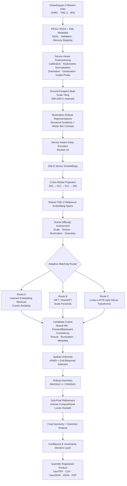

# 🌕 TriNetra
### Sensor-Aware • Illumination-Robust • Spatially Uniform • Sub-Pixel Lunar Image Correspondence

<p align="center">
  <b>Smart India Hackathon 2026 · Problem Statement 26166 · Space Technology</b><br>
  <b>Team AquaIcons · SVKM's NMIMS MPSTME</b>
</p>

<p align="center">
  
  
  
  
  
</p>

> **TriNetra is an end-to-end multimodal lunar image correspondence and registration system designed for Chandrayaan-2's OHRC, TMC-2 and IIRS sensors.**
>
> It combines planetary-data engineering, illumination-invariant computer vision, sensor-aware deep representation learning, adaptive feature matching, robust geometric estimation and sub-pixel refinement into one automated pipeline.

---

## 🏆 Project Highlight

**TriNetra was awarded First Place in the NMIMS internal Smart India Hackathon selection round**, where it was evaluated as the team's solution for SIH 2026 Problem Statement 26166.

The project was developed by **Team AquaIcons**, a six-member interdisciplinary team from NMIMS MPSTME, combining Artificial Intelligence and Computer Engineering expertise.

**Team**
- **Seher Siddiqui** — Team Leader, B.Tech AI
- Jia Jadhav — B.Tech AI
- Tanvi Paithankar — B.Tech AI
- Armaan Shaikh — B.Tech AI
- Aditi Garg — B.Tech AI
- Ishita Punjani — B.Tech Computer Engineering
- **Faculty Mentor:** Prof. Sapna Shah

---

# 🚀 The Problem

### Multi-modal, Sun Angle and Scale Invariant Image Correspondence using Chandrayaan-2 Optical Images

Chandrayaan-2 observes the lunar surface through sensors with dramatically different spatial resolutions, imaging characteristics and viewing conditions:

| Sensor | Approx. Resolution | Role in TriNetra |
|---|---:|---|
| **OHRC** | ~0.25–0.32 m/pixel | Fine-scale local detail |
| **TMC-2** | ~5 m/pixel | Common geometric reference |
| **IIRS** | ~80 m/pixel | Wide-area multispectral / hyperspectral context |

The same crater, ridge or terrain structure can therefore appear radically different between observations.

The correspondence problem is complicated by:

- 🌞 **Extreme illumination changes** caused by different solar incidence angles
- 🔭 **Different viewing geometries** and orbital camera positions
- 🔍 **Huge scale / GSD differences** between sensors
- 🪨 **Low-texture lunar plains** where classical feature detectors become unreliable
- 🌓 **Shadow and brightness changes** that alter pixel appearance without changing terrain
- 📐 **Rotation, perspective and local geometric distortions**
- 🎯 **Sub-pixel registration requirements**
- 📍 The need for **spatially distributed**, rather than heavily clustered, correspondences

A conventional single matcher is therefore not enough.

---

# 💡 What TriNetra Does

TriNetra reframes lunar registration as a **sensor-aware, adaptive correspondence problem**.

Instead of forcing every image pair through one algorithm, the system:

1. Ingests genuine Chandrayaan-2 mission products.
2. Reads PDS metadata and preserves geometric information.
3. Performs sensor-aware preprocessing and quality control.
4. Converts imagery into ground-footprint-aware multi-scale patches.
5. Constructs illumination-robust representations.
6. Learns sensor-specific deep embeddings.
7. Aligns modalities into a shared **256-D cross-modal embedding space**.
8. Estimates scene difficulty.
9. Dynamically routes pairs through learned, classical or dense-deep matching.
10. Fuses candidate correspondences.
11. Enforces spatial uniformity using ANMS and grid balancing.
12. Verifies geometry using MAGSAC++ / RANSAC.
13. Refines correspondences using Inverse Compositional Lucas–Kanade.
14. Re-estimates the final transformation.
15. Quantifies confidence, uncertainty and registration quality.
16. Produces registered scientific products and machine-readable reports.

---

# 🧠 System Architecture



---

# 🔬 The 12-Stage TriNetra Pipeline

## Stage 1 — Planetary Data Ingestion & Validation

TriNetra begins at the mission-data level rather than assuming already-clean images.

### Supported / handled inputs
- PDS3 / PDS4 planetary products
- `.IMG`
- `.QUB`
- GeoTIFF / PNG representations
- PDS4/XML labels and metadata

### Engineering
- GDAL-based planetary image reading
- XML metadata parsing
- Dynamic bit-depth detection
- Data-type normalisation
- Endianness handling
- Invalid-pixel and saturation detection
- Memory-mapped loading for large scenes
- Preservation of:
  - GSD
  - acquisition time
  - sun geometry
  - geolocation
  - orientation
  - sensor identity

The ingestion layer is designed around the actual scale of planetary archives, not small benchmark images.

The current pipeline indexes approximately:

**26,800 catalogue products · ~2,360 observations · ~2,298 three-camera groups**

---

# ☀️ Stage 2 — Scene & Pair Difficulty Assessment

TriNetra does not assume that every image pair has the same matching difficulty.

For each pair, the system estimates:

- Sensor identity
- Ground sampling distance
- Resolution / scale gap
- Solar illumination difference
- Texture strength
- Shadow confidence
- Expected rotation
- Viewpoint difficulty
- Geometric difficulty

The pair is then classified into an **Easy / Moderate / Difficult** regime.

This classification becomes the control signal for the adaptive matcher.

---

# 🖼️ Stage 3 — Multi-Representation & Multi-Scale Preprocessing

Raw intensity alone is unreliable under changing lunar illumination.

TriNetra therefore creates complementary representations.

### 1. Radiometric branch

Preserves:
- Normalised intensity / reflectance
- Validity masks
- Saturation information

This retains physically meaningful radiometric information.

### 2. Illumination-robust branch

Creates:

**Structural gradients**

Capture terrain boundaries and geometric structure rather than absolute brightness.

**Weber-like local contrast**

Normalises local intensity differences relative to local background, making terrain structures more robust to changes in illumination.

**Optional CLAHE**

Used for difficult low-contrast scenes.

**Shadow-confidence information**

Helps downstream stages distinguish terrain structure from shadow-dominated appearance.

### 3. Scale branch

Uses:

- Sensor-specific image pyramids
- Coarse-to-fine representations
- GSD-aware resampling

Rather than destructively forcing every native image into one resolution, TriNetra preserves useful scale information.

---

# 🧠 Stage 4 — Sensor-Aware Deep Feature Learning

This is the core deep-learning component.

## ResNet-18 Encoders

TriNetra uses **sensor-aware ResNet-18 encoders** to transform image tiles into compact learned representations.

Each tile is represented using the illumination-robust structural / Weber-like channels.

### Output

```text
Input
256 × 256 × 2
        ↓
Sensor-specific ResNet-18
        ↓
256-dimensional embedding
```

The goal is not merely classification.

The network learns an embedding where:

> patches showing the same physical lunar region should be close together even when captured by different sensors.

---

# 🔗 Cross-Modal Projection Learning

Sensor-specific 256-D embeddings are mapped into a common space using:

```text
256 → 512 → 512 → 256
```

cross-modal projection networks.

The architecture explicitly aligns:

```text
OHRC ───────────┐
                ├──→ Shared 256-D Space → TMC-2 Reference
IIRS ───────────┘
```

### Learning objective

TriNetra uses contrastive / metric-learning principles:

- Positive pairs → pulled together
- Negative pairs → pushed apart
- Sensor-pair compatibility → explicitly modelled
- OHRC ↔ TMC-2
- IIRS ↔ TMC-2

This transforms heterogeneous image correspondence into a searchable embedding-retrieval problem.

---

# 🔎 Stage 5 — Adaptive Candidate Matching Router

This is one of TriNetra's key architectural decisions.

Instead of:

```text
Image Pair → One Matcher → Registration
```

TriNetra uses:

```text
Image Pair
    ↓
Difficulty Assessment
    ↓
Adaptive Router
    ├── Learned Retrieval
    ├── Classical SIFT / RootSIFT
    └── Dense Lunar Transformer
```

## Route A — Learned Embedding Retrieval

The shared 256-D representation is:

- L2-normalised
- indexed / searched
- ranked using cosine similarity
- used for cross-modal candidate retrieval

This provides scalable coarse correspondence discovery.

## Route B — Classical Computer Vision

**SIFT / RootSIFT** is used as a robust fallback for cases where local invariant descriptors remain effective.

TriNetra additionally uses:

- Scale pyramids
- Rotation handling
- Increased retrieval top-k when required

Classical CV is therefore not discarded; it is selectively used where it is useful.

## Route C — Dense Deep Matching

For difficult scenes, TriNetra can activate a:

**Lunar-adapted LoFTR-style detector-free transformer route**

This is intended for:

- Texture-poor terrain
- Severe illumination changes
- Large appearance differences
- Difficult local correspondence

### Why adaptive routing?

The heavy transformer route is not required for every pair.

TriNetra selectively activates expensive matching only when scene difficulty warrants it, combining accuracy-oriented deep matching with practical compute requirements.

---

# 🧩 Stage 6 — Adaptive Candidate Fusion

Different matching routes can generate different candidate correspondences.

TriNetra combines them using:

- Cross-modal embedding similarity
- SIFT / descriptor similarity
- Mutual nearest-neighbour consistency
- Forward-backward consistency
- Local texture quality
- Illumination compatibility
- Metadata consistency
- Geographic consistency
- Preliminary geometric consistency

Instead of immediately producing a binary match / no-match decision, the system produces a **ranked candidate set with confidence scores**.

---

# 📍 Stage 7 — Spatial Uniformity Regulation

A major failure mode of classical matching is:

> many matches on the easiest crater rim + almost no matches elsewhere.

TriNetra explicitly measures and corrects this.

### Techniques

**Adaptive Non-Maximal Suppression (ANMS)**

Reduces dense correspondence clusters.

**Grid-balanced selection**

Limits excessive concentration within local regions.

**Spatial diagnostics**

The pipeline records:

- Grid coverage
- Spatial entropy
- Convex-hull coverage
- Centre/edge balance
- Local point density

This ensures that correspondences describe the **scene**, rather than only its easiest high-contrast features.

---

# 🎯 Stage 8 — Robust Geometric Verification

Candidate matches are passed through robust geometric estimation.

### Primary estimator

**MAGSAC++**

Used for robust model estimation and inlier/outlier classification.

### Fallback

**RANSAC**

Used when MAGSAC++ does not converge cleanly.

### Model handling

The system can evaluate:

- Similarity transformation
- Affine transformation
- Homography

with geometry-driven model selection.

It also checks:

- Reprojection residuals
- Transformation stability
- Degenerate models
- Physically implausible transformations

Only geometrically supported correspondences survive.

---

# 🎯 Stage 9 — Sub-Pixel Correspondence Refinement

Pixel-level matching is not the end of the pipeline.

TriNetra performs local refinement using:

## Inverse Compositional Lucas–Kanade (IC-LK)

For each verified correspondence:

```text
Initial inlier
      ↓
Local image patch
      ↓
IC-LK optimisation
      ↓
Fractional-pixel coordinate
      ↓
NCC / correlation validation
      ↓
Hessian + texture conditioning
      ↓
Accepted / rejected refined point
```

The system explicitly rejects unstable points instead of forcing refinement where the image does not contain enough local structure.

Each refined match can carry:

- Refined coordinates
- Refinement displacement
- Local uncertainty

---

# 📐 Stage 10 — Final Geometry & Distortion Analysis

After sub-pixel refinement, TriNetra re-estimates the global transformation.

It computes:

- Global RMSE
- Local grid RMSE
- Local distortion vector fields
- Transformation stability

An optional:

**piecewise-affine / Thin-Plate Spline (TPS)**

model can be introduced when the observed distortion pattern justifies a more flexible local warp.

The system avoids automatically fitting highly flexible transformations to noise.

---

# 🛡️ Stage 11 — Confidence, Uncertainty & Decision Layer

TriNetra does not blindly output every computed registration.

It creates an auditable decision:

```text
ACCEPT
ACCEPT WITH CAUTION
RETRY WITH ALTERNATE ROUTE
REJECT — INSUFFICIENT EVIDENCE
```

The decision considers:

- Inlier count
- Inlier ratio
- RMSE
- Residual distribution
- Spatial coverage
- Transformation stability
- Match confidence
- Refinement uncertainty
- Texture quality
- Illumination quality

This enables large-scale automated processing while retaining a quantitative trust mechanism.

---

# 📦 Stage 12 — Scientific Registered Product

The final stage converts correspondence into reusable scientific outputs.

### Generated visual products

- Warped / registered source image
- Reference image
- Blend / overlay
- Difference map
- Inlier / outlier correspondence overlay
- Local distortion vector field
- Grid-RMSE heatmap

### Machine-readable outputs

- **GeoTIFF**
- **CSV**
- **GeoJSON**
- **JSON validation report**
- **PDF technical report**

### Match Uncertainty Dossier

Per-match information can include:

- Source coordinates
- Reference coordinates
- Similarity score
- Inlier / outlier status
- Geometric residual
- Refinement displacement
- Confidence
- Uncertainty

The result is therefore more than a warped image: it is a **traceable, quality-assessed registration product**.

---

# 📊 Evaluation & Results

## Controlled / Held-Out Evaluation

The technical report documents evaluation on **60 held-out anchor pairs** from genuine Chandrayaan-2 imagery.

| Metric | Result |
|---|---:|
| **Registration Success** | **82.25%** |
| **True-Inlier Precision** | **99.98%** |
| **True-Inlier Recall** | **89.73%** |
| **Mean Inlier RMSE** | **~1.95 px** |
| **Mean Translation Error** | **~2.03 px** |

These results demonstrate that the learned correspondence and registration pipeline was evaluated on real mission imagery rather than only synthetic or terrestrial imagery.

---

## Latest Real-Data Evaluation

A subsequent evaluation run on **2,000 real Chandrayaan-2 datapoints** produced the following project results:

| Metric | Result |
|---|---:|
| **Datapoints evaluated** | **2,000** |
| **Registration Success** | **93.4%** |
| **True-Inlier Precision** | **99.87%** |
| **True-Inlier Recall** | **92.6%** |
| **F1 Score** | **96.10%** |
| **Mean Inlier RMSE** | **0.92 px** |
| **Median Inlier RMSE** | **0.58 px** |
| **Std. RMSE** | **1.08 px** |
| **95th Percentile RMSE** | **1.95 px** |
| **Mean Match Error** | **1.04 px** |
| **Median Match Error** | **0.66 px** |
| **Sub-Pixel Match Rate (<1 px)** | **86.5%** |
| **Mean Inlier Count** | **112** |
| **Median Inlier Count** | **78** |
| **Inlier Ratio** | **76.4%** |

### What these numbers measure

**93.4% registration success**

Measures the proportion of evaluated real datapoints for which the registration pipeline successfully produced an accepted registration.

**99.87% true-inlier precision**

Measures how reliably the pipeline's accepted correspondences are genuinely correct, directly addressing false-match contamination.

**92.6% true-inlier recall**

Measures how much of the available correct correspondence structure is recovered.

**96.10% F1**

Summarises the precision/recall balance for correspondence classification.

**0.92 px mean inlier RMSE**

Quantifies geometric registration error among verified inliers.

**86.5% sub-pixel match rate**

The fraction of evaluated correspondences with match error below one pixel.

**76.4% inlier ratio**

Measures the proportion of candidate correspondences surviving geometric verification.

---

# 📈 Evaluation Philosophy

TriNetra evaluates registration beyond a single accuracy number.

The pipeline records:

### Geometric quality
- RMSE
- Median error
- Translation error
- Reprojection residuals

### Correspondence quality
- Precision
- Recall
- F1
- Inlier count
- Inlier ratio
- Match error

### Spatial quality
- Grid coverage
- Spatial entropy
- Convex-hull coverage
- Local point density

### Stability
- Transformation conditioning
- Degenerate-model rejection
- Local distortion
- Refinement uncertainty

This matters because a registration with ten excellent points clustered around one crater rim is not equivalent to a registration with reliable correspondences distributed throughout the scene.

---

# 🧪 Why the Architecture Is Hybrid

TriNetra deliberately combines **deep learning + classical computer vision + numerical optimisation + robust statistics**.

| Technology | Role |
|---|---|
| **PyTorch** | Deep learning and learned correspondence |
| **ResNet-18** | Sensor-aware feature extraction |
| **Contrastive / metric learning** | Cross-modal embedding alignment |
| **256-D embeddings** | Scalable correspondence retrieval |
| **SIFT / RootSIFT** | Classical invariant feature fallback |
| **LoFTR-style transformer** | Dense difficult-scene matching |
| **OpenCV** | Image processing and geometric CV |
| **MAGSAC++** | Robust geometric estimation |
| **RANSAC** | Geometric fallback |
| **Lucas–Kanade / IC-LK** | Sub-pixel refinement |
| **NCC** | Local refinement validation |
| **ANMS** | Spatial correspondence balancing |
| **GDAL** | Planetary image and metadata handling |
| **NumPy / SciPy** | Numerical computing and optimisation |
| **scikit-learn** | Auxiliary ML / evaluation routines |
| **rasterio / xarray** | Coordinate-aware raster handling |
| **JSON / CSV / GeoTIFF / GeoJSON** | Scientific data interchange |

---

# 🛰️ Mission Data Engineering

One of the most important design choices is that TriNetra begins with **mission data**, not generic images.

The ingestion pipeline is designed to work with:

```text
PRADAN
  ↓
Chandrayaan-2 Products
  ↓
PDS3 / PDS4 Metadata
  ↓
Calibration + QC
  ↓
Geolocation + Orientation
  ↓
Ground-Footprint Tiling
  ↓
AI / CV Correspondence
```

The system currently covers approximately:

- **26,800 catalogue products**
- **~2,360 observations**
- **~2,298 three-camera groups**

This makes data engineering and metadata preservation an integral part of the computer-vision system.

---

# 🧬 What Makes TriNetra Different

### 1. Adaptive routing instead of one matcher

The system does not assume SIFT, a CNN or a transformer will solve every scene.

Difficulty estimation determines the appropriate matching route.

### 2. Illumination robustness is built into the representation

Structural gradients and Weber-like local contrast are generated before matching rather than treating illumination as a last-minute preprocessing problem.

### 3. Spatial uniformity is explicitly enforced

ANMS and grid balancing prevent correspondences from collapsing onto only the most visually obvious crater edges.

### 4. Sub-pixel refinement is a dedicated stage

IC-LK refinement is explicitly optimised, validated and rejected when local evidence is insufficient.

### 5. Confidence is treated as a first-class output

The system can decide whether a registration should be accepted, retried or rejected.

### 6. The pipeline is modular

Ingestion, preprocessing, embedding, retrieval, matching, geometric verification, refinement and reporting are separated into independently testable stages.

### 7. The system is designed for heterogeneous planetary sensors

The same conceptual architecture can be extended to additional sensors and future planetary missions.

---

# 🌍 Potential Applications

TriNetra can support workflows involving:

- 🛰️ Multi-sensor lunar mapping
- 🌕 Lunar terrain analysis
- 🗺️ Geodetic control-point generation
- 🔍 Feature correspondence across observations
- 📊 Multi-resolution terrain analysis
- 🌗 Illumination-robust change analysis
- 🧭 Mission planning and data exploitation
- 🧪 Planetary computer-vision research
- 🌐 Remote sensing and GIS workflows

The architecture is designed to be extensible toward future lunar datasets and additional planetary missions.

---

# 📁 Repository Structure

The repository contains the implementation, experiments, notebooks, metadata-processing modules and evaluation artefacts used during development.

Representative components include:

```text
TriNetra/
│
├── PRADAN_archive_discovery/
│   ├── metadata/
│   └── archive discovery / grouping
│
├── Integrated_Multimodal_Siamese/
│   ├── evaluation/
│   ├── pairs/
│   └── visualizations/
│
├── Synthetic_Registration_Benchmark/
│   └── results/
│
├── Integrated_Multimodal_Siamese_Model.ipynb
├── TMC2_Preprocessing_Encoder_Pipeline.ipynb
├── OHRC_TMC2_Correspondence_Model.ipynb
├── IIRS_TMC2_Correspondence_Model.ipynb
├── Synthetic_Registration_Benchmark.ipynb
└── ...
```

> Large raw mission archives, tiled datasets and trained model binaries are intentionally excluded from the public Git history. The repository therefore focuses on the reproducible code, experiments, metadata and results needed to understand and extend the system.

---

# ⚙️ Installation

```bash
git clone https://github.com/sehersiddiqui/SIH-26166-ISRO-Chandrayaan-DL-Model.git
cd SIH-26166-ISRO-Chandrayaan-DL-Model
```

Create an environment:

```bash
python -m venv .venv
```

### Windows

```powershell
.venv\Scripts\activate
```

### Linux / macOS

```bash
source .venv/bin/activate
```

Install the required Python dependencies according to the project's environment / notebook requirements.

Core ecosystem:

```text
Python
PyTorch
OpenCV
NumPy
SciPy
GDAL
rasterio
xarray
scikit-learn
```

---

# 🔁 End-to-End Data Flow

```text
RAW CHANDRAYAAN-2 DATA
        │
        ▼
PDS3 / PDS4 + XML
        │
        ▼
MISSION DATA INGESTION
        │
        ▼
CALIBRATION + QC + GEOLOCATION
        │
        ▼
GROUND-FOOTPRINT TILING
        │
        ▼
GRADIENT + WEBER REPRESENTATIONS
        │
        ▼
SENSOR-SPECIFIC RESNET-18
        │
        ▼
256-D EMBEDDINGS
        │
        ▼
CROSS-MODAL PROJECTION
        │
        ▼
SHARED TMC-2 REFERENCE SPACE
        │
        ▼
SCENE DIFFICULTY ESTIMATION
        │
        ├───────────────┬────────────────┐
        ▼               ▼                ▼
   EMBEDDING          SIFT/             LUNAR
   RETRIEVAL        ROOTSIFT           LoFTR
        │               │                │
        └───────────────┴────────────────┘
                        │
                        ▼
                CANDIDATE FUSION
                        │
                        ▼
                ANMS + GRID BALANCE
                        │
                        ▼
                  MAGSAC++ / RANSAC
                        │
                        ▼
                     IC-LK
                        │
                        ▼
              FINAL GEOMETRY ESTIMATION
                        │
                        ▼
             CONFIDENCE + UNCERTAINTY
                        │
                        ▼
             REGISTERED SCIENTIFIC PRODUCT
```

---

# 🧠 Core Design Principle

TriNetra is built around one central idea:

> **Do not ask one algorithm to solve every lunar image pair.**

Instead:

```text
Understand the sensor
        +
Understand the scene
        +
Build illumination-robust representations
        +
Learn cross-modal semantics
        +
Choose the appropriate matcher
        +
Fuse evidence
        +
Enforce spatial coverage
        +
Verify geometry robustly
        +
Refine to sub-pixel precision
        +
Quantify uncertainty
```

That combination turns image registration from a single feature-matching operation into an **adaptive, auditable correspondence system**.

---

# 🧭 Roadmap

Future development directions include:

- [ ] Expand validation beyond the current evaluation sets
- [ ] Stratify experiments across Easy / Moderate / Difficult scenes
- [ ] Full-archive batch processing
- [ ] Complete and validate TPS / piecewise-affine local refinement
- [ ] Extend sensor-aware embeddings to additional planetary sensors
- [ ] Extend toward Chandrayaan-3 datasets
- [ ] Integrate additional lunar reference datasets such as LROC / SELENE
- [ ] Package the modular pipeline as a containerised service
- [ ] GPU-optional deployment for research workstations
- [ ] Larger-scale uncertainty calibration and statistical validation

---

# 📚 Research Foundation

TriNetra's design draws from research across:

### Multimodal remote sensing registration
- Zhu et al. (2024) — Multimodal Remote Sensing Image Registration: A Survey
- Bai et al. (2023) — Advances and Challenges in Multimodal Remote Sensing Image Registration
- Liao et al. (2024) — Refining Multi-modal Remote Sensing Image Matching with Repetitive Feature Optimization

### Deep learning & feature matching
- He et al. (2016) — Deep Residual Learning for Image Recognition
- Sun et al. (2021) — LoFTR: Detector-Free Local Feature Matching with Transformers
- Yao et al. (2025) — Deep Learning in Remote Sensing Image Matching: A Survey

### Geometric verification & registration
- Fischler & Bolles (1981) — RANSAC
- Ma et al. (2022) — Sub-pixel Image Registration for Remote Sensing
- Chen et al. (2023) — Geometric and Radiometric Invariant Feature Learning for Cross-Sensor Remote Sensing Image Matching

Additional references and implementation resources are documented in the project report and repository.

---

# 📄 Project Documentation

The complete technical report contains the detailed methodology, architecture, technology stack, validation, feasibility analysis, novelty discussion, impact analysis and references.

**Detailed Report:**

https://drive.google.com/drive/folders/12KGtlKd3MlvyETMvqET6z-VJurLj_UKf?usp=sharing

---

# 👥 Team AquaIcons

### Smart India Hackathon 2026 — Problem Statement 26166

**TriNetra** was developed by:

| Member | Role | Programme |
|---|---|---|
| **Seher Siddiqui** | Team Leader | B.Tech AI |
| Jia Jadhav | Team Member | B.Tech AI |
| Tanvi Paithankar | Team Member | B.Tech AI |
| Armaan Shaikh | Team Member | B.Tech AI |
| Aditi Garg | Team Member | B.Tech AI |
| Ishita Punjani | Team Member | B.Tech Computer Engineering |

**Faculty Mentor:** Prof. Sapna Shah, Assistant Professor, B.Tech AI, SVKM's NMIMS MPSTME

---

# ⭐ Final Note

TriNetra is not simply a SIFT replacement or a neural-network feature matcher.

It is a complete pipeline spanning:

**Planetary Data Engineering → Computer Vision → Deep Representation Learning → Cross-Modal Retrieval → Adaptive Matching → Robust Statistics → Geometric Registration → Sub-Pixel Optimisation → Uncertainty Quantification → Scientific Data Products**

The objective is to make heterogeneous lunar observations computationally comparable while preserving the geometric, radiometric and scientific information required for downstream planetary analysis.

---

<p align="center">
  <b>🌕 TriNetra — Three Sensors. One Shared View of the Moon.</b>
</p>
